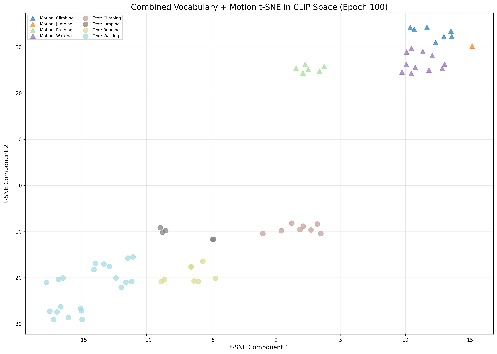
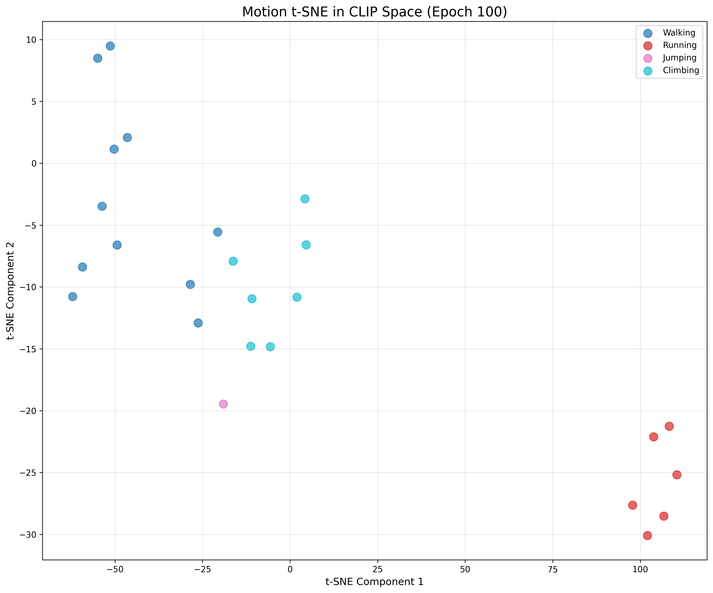
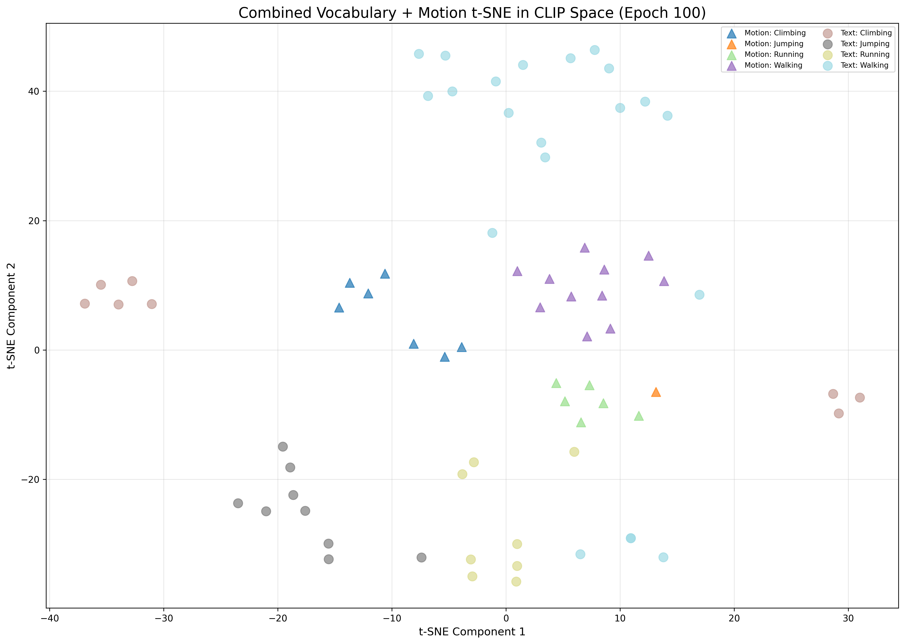

# Training Log

### 20260105 G1AMASS_Rep_Rot6D Trained better

**xyz with trans**

The representation rot6d seems to work better for G1AMASS dataset.

PROBLEM: This run do not use rot6d actually, because of the bug in `dataset.py`.

```bash
python -m src.train.train --modelname motionclip_transformer_rc_vel \
--clip_text_losses cosine --clip_image_losses cosine --pose_rep xyz \
--clip_lambda_cosine 1.0 \
--lambda_vel 100 --lambda_rc 100 --lambda_rcxyz 100 \
--jointstype vertices --batch_size 20 --num_frames 60 --num_layers 8 \
--lr 0.0001 --glob --translation --no-vertstrans --latent_dim 512 --num_epochs 100 --snapshot 10 \
--device 0 \
--dataset g1_amass \
--datapath ./data/g1_amass_db/amass_30fps_db.pt \
--folder ./exps/g1-model-xyz \
--use_g1
```

tSNE



Training with CLIP Text losses only
```bash
python -m src.train.train --modelname motionclip_transformer_rc_vel \
--clip_text_losses cosine --pose_rep xyz \
--clip_lambda_cosine 5.0 \
--clip_training text \
--lambda_vel 100 --lambda_rc 100 --lambda_rcxyz 100 \
--jointstype vertices --batch_size 20 --num_frames 60 --num_layers 8 \
--lr 0.0001 --glob --translation --no-vertstrans --latent_dim 512 --num_epochs 100 --snapshot 10 \
--device 0 \
--dataset g1_amass \
--datapath ./data/g1_amass_db/amass_30fps_db.pt \
--folder ./exps/g1-model-xyz-clip \
--use_g1
```

> This mode aligns text & motion better.


**rot6d with trans**

```bash
python -m src.train.train --modelname motionclip_transformer_rc_vel \
--clip_text_losses cosine --clip_image_losses cosine --pose_rep rot6d \
--clip_lambda_cosine 1.0 \
--lambda_vel 100 --lambda_rc 100 --lambda_rcxyz 100 \
--jointstype vertices --batch_size 20 --num_frames 60 --num_layers 8 \
--lr 0.0001 --glob --translation --no-vertstrans --latent_dim 512 --num_epochs 100 --snapshot 10 \
--device 0 \
--dataset g1_amass \
--datapath ./data/g1_amass_db/amass_30fps_db.pt \
--folder ./exps/g1-model-rot6d \
--use_g1
```

**pos & quat**

```bash
python -m src.train.train --modelname motionclip_transformer_rc_vel \
--clip_text_losses cosine --clip_image_losses cosine --pose_rep posquat \
--clip_lambda_cosine 1.0 \
--lambda_vel 100 --lambda_rc 100 --lambda_rcxyz 100 \
--jointstype vertices --batch_size 20 --num_frames 60 --num_layers 8 \
--lr 0.0001 --glob --translation --no-vertstrans --latent_dim 512 --num_epochs 100 --snapshot 10 \
--device 0 \
--dataset g1_amass \
--datapath ./data/g1_amass_db/amass_30fps_db.pt \
--folder ./exps/g1-model-posquat \
--use_g1
```

**pos & vel**

```bash
python -m src.train.train --modelname motionclip_transformer_rc_vel \
--clip_text_losses cosine --clip_image_losses cosine --pose_rep posvel \
--clip_lambda_cosine 1.0 \
--lambda_vel 100 --lambda_rc 100 --lambda_rcxyz 100 \
--jointstype vertices --batch_size 20 --num_frames 60 --num_layers 8 \
--lr 0.0001 --glob --translation --no-vertstrans --latent_dim 512 --num_epochs 100 --snapshot 10 \
--device 0 \
--dataset g1_amass \
--datapath ./data/g1_amass_db/amass_30fps_db.pt \
--folder ./exps/g1-model-posvel \
--use_g1
```